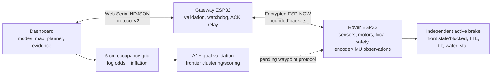
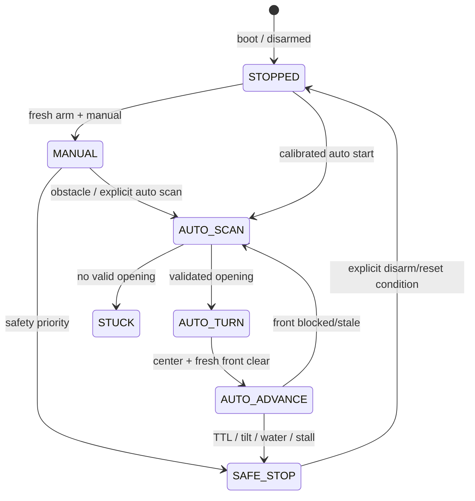

# Hybrid autonomy gap audit

Date: 2026-08-27
Baseline: `57ac5f9`
Scope: only unfinished or partially finished work from the hybrid-autonomy brief

## Outcome

The repository already had the P0 manual-control, radio-watchdog, front-safety,
stationary-scan, honest telemetry, and approximate mapping foundation. This
pass did not rewrite those modules. It closed the two most useful software
gaps that can be verified without driving the rover:

1. Production encoder acquisition now preserves raw, accepted, debounce-
   rejected, and motor-state-rejected evidence with atomic snapshots and pulse
   interval statistics.
2. The laptop map now has timestamped pose interpolation, canonical scan
   bearings, 5 cm occupancy cells, A*, bounded goal validation, frontier
   clustering/scoring, and failed-branch pose matching.

The follow-up implementation now supplies a laptop mission coordinator for
`EXPLORE`, click-to-`NAVIGATE`, waypoint following, and Return Home over the
existing bounded protocol-v2 drive stream. It replans only through known-free
inflated cells and fails closed on missing pose, link, or either front sensor.
This is software-complete but **not physically demonstrated** because odometry
commissioning remains open.

## Done, changed, and still left

| Area | Baseline evidence | This pass improves | Still left / blocker |
| --- | --- | --- | --- |
| Manual control and safety | Signed drive, local front gate, active brake, gateway heartbeat, rover TTL | Preserved unchanged | Physical kill-switch, timeout, reset, and obstacle tests on the assembled rover |
| Forward sensing | HC-SR04 validity/freshness/hysteresis fails closed; a disarmed diagnostic can compare centered ToF | Production front gate now requires fresh HC-SR04 and centered top VL53L0X; the nearer valid range wins | Physically validate both channels and measured stopping thresholds |
| Hardware authority | `DeeptrackHardware.h` already centralized pins | Compile-time assertion now locks encoders to GPIO34/35 | Confirm external pull-ups, voltage, edge shape, and physical wiring |
| Encoder capture | Mission firmware exposed only signed command-gated totals on `RISING` | `FALLING`; raw/accepted/rejected counters; min/avg/max intervals; atomic snapshots; configurable debounce/gate/coast; protocol-v2 telemetry; stationary noise and manual-disc isolation physically passed | Diagnose 78–85% left debounce rejection, recheck one transient inactive-right edge, then complete reverse/right/PWM isolation and loaded distance/turn calibration when physical commissioning resumes |
| Persistent calibration | Geometry, directions, water/gas, and IMU already used Preferences | Versioned validated `EncoderConfig` with separate left/right ticks-per-metre and balance placeholders | Ground calibration routine, measured curves, stopping table, validated gains |
| Scan semantics | Non-blocking stationary seven-angle scan existed | Radio angle is canonical (`90°` forward, `>90°` left) and scan packets carry rover uptime | Hardware-confirm servo direction/center and ToF offsets |
| Pose and mapping | Differential ticks, log-odds rays, unknown blocking, inflation existed | Separate left/right scales supported; bounded gyro correction; timestamped pose interpolation; 5 cm cells | Encoder/IMU physical sign validation, uncertainty growth on discarded ticks/stalls, map persistence |
| Global planning | A function named path planning used breadth-first search | A*, goal rejection/snap, frontier scoring, and a TTL-refreshed route follower with dynamic replanning | Bounded physical waypoint-course acceptance |
| Exploration memory | No persistent decision graph | Tolerance-based failed-branch pose matcher is tested | Decision-node lifecycle, cooldowns, branch states, backtracking coordinator |
| Mission lifecycle | Rover has a smaller local `AUTO_SCAN`/turn/recheck state machine | Dashboard coordinator adds Explore, Navigate, Return Home, goal completion, progress timeout, pause and halt; rover retains final collision/TTL authority | Physical course validation and richer decision-graph recovery |
| Dashboard | Live estimated map and scan rays existed | Mission controls/status, click-to-goal, Home, dual-front detail, and a top-view rover marker | Map save/load and physical mission validation |
| Diagnostics safety | Legacy sketch had boot autorun and unproven power-bank keepalive options | Boot autorun disabled; keepalive cannot be enabled without validated dedicated hardware; stale L298 comment corrected to TB6612; production firmware now has leased bounded validation tests | Execute `docs/PHYSICAL_ODOMETRY_VALIDATION.md` on the assembled rover and return raw evidence |

## Contradictions resolved

| Conflict | Evidence-based decision |
| --- | --- |
| Encoder document says L298N; repository wiring and mission motor code use two TB6612FNG boards | TB6612FNG is authoritative. The legacy diagnostic comment was corrected; no L298 behavior is claimed. |
| Encoder document proposes GPIO34/35 and FALLING; mission used GPIO34/35 but `RISING` | Hardware authority already assigns 34/35 and requires external pull-ups. Diagnostics already used `FALLING`; mission now matches it. The edge still requires physical validation. |
| Encoder document presents 1500 µs as a solution | 1500 µs remains a configurable commissioning default. Raw edges, rejected edges, and accepted interval statistics make the physical test observable. |
| Document suggests motor-state gating solves cross-talk | Gating is optional and raw counts never disappear. State-rejected counts quantify what was hidden; discarded motion remains a localization limitation. |
| Document suggests a 1 kHz L298 PWM rule; mission uses 18 kHz | No frequency was changed without TB6612 hardware evidence. Mission remains at its compiled 18 kHz; diagnostics remains at a clearly labelled conservative 1 kHz bench setting. |
| Document proposes pulsing a load to keep a power bank awake | Disabled. No validated dedicated non-motion load is documented. |
| Concept mentions a ThinkPad battery payload | Repository authority documents protected 2S-to-5 V logic power, separate 4xAA NiMH motor VM, common ground, and USB-powered gateway. Physical rail measurements are still required. |
| Requested system calls for full frontier exploration and navigate-to-goal; baseline UI said “Autonomous” | Current rover AUTO is a bounded local scan/turn/recheck behavior, not full exploration. New laptop algorithms are foundations only; the UI must not claim full navigation completion. |

## Final architecture



## Authoritative rover wiring

| Function | GPIO | Electrical note |
| --- | ---: | --- |
| DHT22 data | 23 | 3.3 V logic with pull-up |
| MQ-4 analog | 36 | ADC1; divider required |
| Water analog | 39 | ADC1 |
| HC-SR04 trigger / echo | 19 / 18 | Echo divider required |
| I2C SDA / SCL | 21 / 22 | MPU6050 `0x68`, VL53L0X `0x29` |
| Left / right LM393 encoder | 34 / 35 | Input-only; external pull-ups; `FALLING` candidate |
| Scanner servo | 13 | Separate power integrity must be checked |
| Buzzer / red / green LED | 4 / 26 / 27 | Follow driver/resistor wiring guide |
| Left TB6612 PWM / IN1 / IN2 | 25 / 14 / 16 | One control triplet fans to left front/rear channels |
| Right TB6612 PWM / IN1 / IN2 | 17 / 33 / 32 | One control triplet fans to right front/rear channels |
| TB6612 STBY | hardwired 3.3 V | No invented GPIO control |

Gateway: SDA 21, SCL 22, LCD `0x27`, red/yellow/green LEDs 25/26/27,
and USB serial to the laptop.

## Current and required state machines

The production rover currently implements the smaller safe subset below:



Still required on the hybrid coordinator: `EXPLORE_SCAN`,
`WAITING_FOR_PLAN`, `FOLLOWING_PATH`, `LOCAL_AVOIDANCE`, bounded recovery,
`BACKTRACKING`, `NAVIGATING_TO_GOAL`, `RETURNING_HOME`, `DEGRADED`, and
`FAULT`, with every transition reason visible.

## Encoder filter and calibration design

On every interrupt the production rover now:

1. increments the raw edge count;
2. rejects an edge inside the configurable accepted-pulse interval;
3. optionally rejects an edge outside the corresponding motor/coast window;
4. signs an accepted edge from the commanded wheel direction;
5. records accepted interval min/sum/max/count;
6. exposes an atomic multi-counter snapshot to stall logic, telemetry, and CLI.

`enc`, `resetenc`, `encdebounce`, `encgate`, `encscale`, and
`config show/save/reset` are available in mission firmware. `encscale` stores
measured **ticks per metre**, separately per side. Protocol v2 transports the
derived left/right micrometres per tick.

The lifted-wheel test can validate signal quality and relative response only.
Loaded forward/reverse distance and 90°/180° turn runs are still required to
establish left/right scales, track correction, useful PWM, stopping distance,
and variance. Encoder balance remains disabled until those measurements exist.

## Map and planner conventions

- World origin/Home is intended to be the pose captured at exploration start;
  automatic Home capture is not implemented yet.
- `+x` is the initial rover-forward direction, `+y` is counter-clockwise/left,
  and heading is radians counter-clockwise from `+x`.
- Grid resolution is 0.05 m/cell.
- Scan `90°` is forward; values greater than 90° are left.
- Log-odds accumulate free evidence along a ray and occupied evidence at a
  valid hit. Unknown and uncertain cells are not traversable.
- Inflation radius is half chassis width plus the current 0.05 m starting
  safety margin. Localization uncertainty still needs to be added dynamically.
- A* uses four-connected known-free cells and never crosses inflated cells.
- Frontier score exposes information gain, clearance, untried bonus,
  communication confidence, path length, turns, pose uncertainty, revisits,
  and failed-route penalty as separate terms.

## Protocol v2 interface

The packed ESP-NOW telemetry packet is 88 bytes, below the 250-byte v1 payload
limit. In addition to the existing sensor/state/calibration fields it contains:

```text
left_ticks / right_ticks                    signed accepted odometry ticks
left_raw_ticks / right_raw_ticks            every interrupt edge
left/right_rejected_debounce_ticks          interval filter evidence
left/right_rejected_state_ticks             motor/coast gate evidence
left/right_micrometers_per_tick             independent measured scales or 0
```

Scan packets remain one sample per bounded packet and now have a timestamp plus
canonical bearing. Sequence/session/version checks and command leases remain
unchanged. Both ESP32 images and the dashboard must run v2 together.

## Verification performed

```text
./scripts/firmware/test-host.sh
./scripts/firmware/compile.sh rover-mission
./scripts/firmware/compile.sh gateway-mission
cd dashboard
npm run test:console
npm run audit:ui
npm run check
npm run build
```

Software-only checks do not prove encoder signal quality, motor behavior,
mapping accuracy, or Return Home.

## Files changed and why

| File | Purpose |
| --- | --- |
| `firmware/shared/DeeptrackHardware.h` | Lock the audited GPIO34/35 encoder assignment at compile time. |
| `firmware/shared/DeeptrackThresholds.h` | Centralize unvalidated encoder filter/gate/coast defaults. |
| `firmware/shared/DeeptrackRuntimeSafety.h`, `firmware/tests/runtime_safety_test.cpp` | Add and test pure debounce/coast timing rules including wrap behavior. |
| `firmware/shared/DeeptrackProtocol.h` | Version-2 encoder evidence and per-side calibration packet fields. |
| `rover/DeeptrackRover/DeeptrackRover.ino` | Atomic encoder evidence, NVS config/CLI, canonical scan bearing, v2 telemetry. |
| `rover/RoverDiagnostics/RoverDiagnostics.ino` | Correct TB6612 wording and disable unsafe/unvalidated boot autorun and keepalive activation. |
| `rover/ENCODER_SUBSYSTEM_SPEC.md` | Mark the L298/ThinkPad-era document as a historical hypothesis, not current authority. |
| `gateway/DeeptrackGateway/DeeptrackGateway.ino` | Relay v2 encoder evidence and rover-uptime scan timestamps over NDJSON. |
| `dashboard/src/lib/state/estimatedMap.js` | Timestamped pose/rays, gyro fusion, 5 cm map, A*, goals, frontiers, scoring, branch matching. |
| `dashboard/src/lib/state/gatewayProtocol.js`, `dashboard/src/lib/state/telemetry.js`, `dashboard/src/lib/schemas/telemetry.js` | Normalize and validate protocol-v2 evidence. |
| `dashboard/src/lib/components/EstimatedRouteCanvas.svelte` | Render frontier and inflated-cell layers. |
| `dashboard/src/lib/components/dashboard/HardwareView.svelte` | Fix two missing accessible input names. |
| `dashboard/src/routes/dashboard/+page.svelte` | Use scan timestamps and show encoder evidence. |
| `dashboard/src/lib/mocks/telemetryMock.js` | Keep explicitly simulated protocol-v2 fields complete. |
| `dashboard/scripts/test_estimated_map.js`, `dashboard/scripts/test_gateway_protocol.js` | Deterministic coverage for new map/planner/protocol behavior. |
| `README.md`, `docs/PROTOCOL.md`, `docs/HARDWARE_ACCEPTANCE_CHECKLIST.md`, `docs/TEST_RESULTS.md` | Update truthful scope, compatibility, acceptance, and test evidence. |
| `docs/AUTONOMY_GAP_AUDIT.md` | Record this focused audit, remaining work, diagrams, and runbook. |

## Physical tests still required, in order

1. Verify rails, divider voltages, common ground, TB6612 STBY, physical kill
   switch, and wheels-up motor directions.
2. With motors stopped, record raw encoder noise for both inputs using the
   leased validation runner.
3. Run left only, right only, forward, and reverse at several PWM values;
   compare raw/accepted/rejected counts and pulse intervals.
4. Repeat under motor/servo noise and confirm no inactive-side cross-talk is
   being hidden by the gate.
5. Perform loaded measured-distance and turn calibration; record spread.
6. Measure stopping distance and set stop/resume thresholds from evidence.
7. Verify IMU Z sign/bias and servo left/right/center conventions.
8. Reflash both protocol-v2 images and rerun link loss, reset, stale command,
   invalid-front-sensor, and one-encoder-disconnected tests.
9. Only then enable short-course waypoint following and measure route error.

## Hackathon demo runbook

1. Keep wheels lifted; verify physical motor switch and power rails.
2. Flash matching protocol-v2 rover and gateway images.
3. Run `config show`, `enc`, front range, IMU, and scan diagnostics while
   disarmed. State clearly that unmeasured values remain unknown.
4. Connect the real dashboard and show live raw/accepted/rejected encoder
   evidence, scan rays, occupancy evidence, inflation, and frontier cells.
5. Demonstrate hold-to-drive at low power with immediate release stop, then
   the front-obstacle active brake and communication-loss stop.
6. Demonstrate planner behavior in deterministic software/demo data: unknown
   goal rejection, safe snapping, A*, and inspectable frontier scoring.
7. Do not demonstrate Return Home or click-to-drive until the physical
   calibration and waypoint follower pass their bounded course tests.

## Strict next priority

1. Complete electrical and encoder physical acceptance.
2. Add time-aligned forward-sensor fusion and measured clearance-based speed
   reduction while keeping unknown/stale readings fail-closed.
3. Implement a cancelable loaded ground-calibration workflow and record
   independent side scales/turn/stopping variance.
4. Add a versioned bounded waypoint packet, rover path-following state, ACK,
   progress timeout, and cancel command.
5. Wire A*/goal/frontier outputs to that follower; add Home capture and Return
   Home through the same planner.
6. Add decision-node/branch lifecycle, failed-route cooldowns, recovery, and
   map-based backtracking.
7. Add map persistence and environmental overlays only after navigation is
   physically credible.
